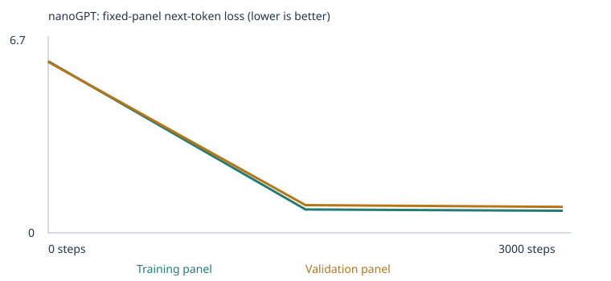
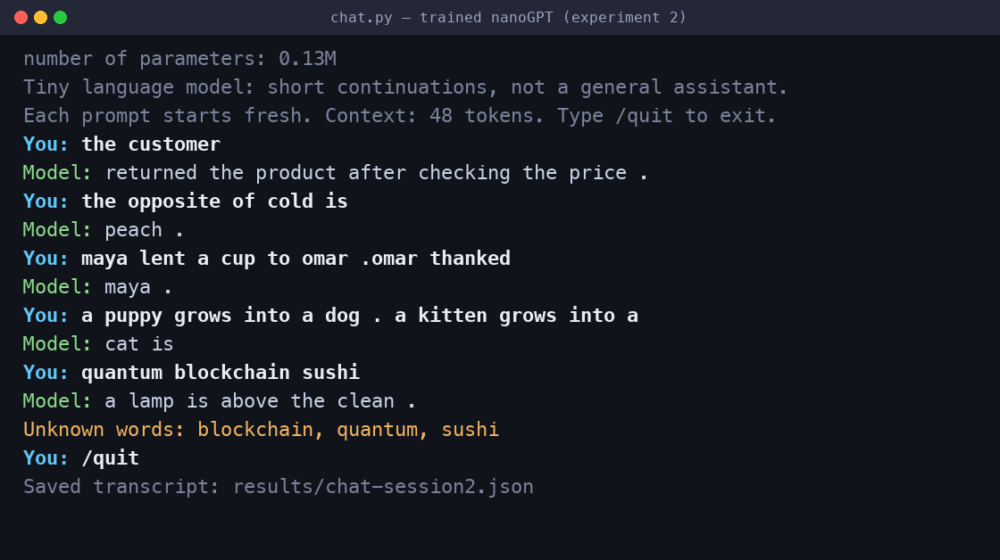

# Building a Custom LLM — Class 4

Training Karpathy's nanoGPT from scratch on a word-token corpus, measuring it with a fixed
48-case language eval suite before and after training in two experiments, and talking to the
result through a terminal chat interface.

**This is a ~130k-parameter model with a 48-token context trained for 10 seconds on synthetic
sentences.** It is not a chat assistant. It continues sentences in the shapes it was shown.
Everything below reports what it actually did, including where it failed and where my
predictions were wrong.

| | |
|---|---|
| Executed notebook, experiment 1 | [`custom_llm_experiment1_starter.ipynb`](custom_llm_experiment1_starter.ipynb) |
| Executed notebook, experiment 2 | [`custom_llm_experiment2_extended.ipynb`](custom_llm_experiment2_extended.ipynb) |
| Experiment 1 run (starter corpus) | [`llm_runs/20260921T220602_231016Z/`](llm_runs/20260921T220602_231016Z/) |
| Experiment 2 run (extended corpus) | [`llm_runs/20260921T220633_918630Z/`](llm_runs/20260921T220633_918630Z/) |
| Eval suite (unchanged) | [`evals/language_evals.json`](evals/language_evals.json) |
| Chat evidence | [screenshot](results/chat-screenshot.png) · [session recording](results/chat-session-recording.txt) · [transcript](results/chat-experiment2.json) |

---

## 1. Headline results

All four required result sets. Settings were identical across both experiments
(3,000 steps, learning rate 0.001, seed 42) so that **the corpus is the only variable**.

| Experiment | Stage | All-case | Scorable acc | Coverage | starter_patterns | starter_transfer | extend_corpus |
|---|---|---|---|---|---|---|---|
| 1 starter | untrained | 9/48 (18.8%) | 37.5% | 24/48 | 6/16 | 3/8 | 0/24 |
| 1 starter | **final** | **20/48 (41.7%)** | 83.3% | 24/48 | 16/16 | 4/8 | 0/24 |
| 2 extended | untrained | 14/48 (29.2%) | 29.2% | 48/48 | 5/16 | 2/8 | 7/24 |
| 2 extended | **final** | **44/48 (91.7%)** | 91.7% | 48/48 | 16/16 | 8/8 | 20/24 |

Result sets: [E1 untrained](llm_runs/20260921T220602_231016Z/language_evals/untrained/) ·
[E1 final](llm_runs/20260921T220602_231016Z/language_evals/final/) ·
[E2 untrained](llm_runs/20260921T220633_918630Z/language_evals/untrained/) ·
[E2 final](llm_runs/20260921T220633_918630Z/language_evals/final/)

**Read the 44/48 carefully — a large part of it is not learning.** In experiment 1, 24 of the
48 cases contained words the starter corpus never uses, so they were marked
`out_of_vocabulary` and scored 0 automatically. Coverage was capped at 24/48 and no amount of
extra training could have moved it. Adding teaching material put those words in the
vocabulary, so those 24 cases became *answerable*. Answerable cases get a 1-in-4 guess, which
is ~6 correct from chance alone. **So ~26/48 was the null result, not 20/48.** The genuine
learning claim is the 18 cases above chance, not the full 24-point jump.

Two mechanisms are at work and the README keeps them separate throughout:

- **Vocabulary coverage** — did the word exist at all? Solved, verifiable *before* training.
- **Learned pattern** — given the words, did the model pick the right one? Uncertain, and the
  thing actually worth measuring.

### Per-category breakdown

| Category | E1 untr | E1 final | E2 untr | E2 final | scorable in E2 |
|---|---|---|---|---|---|
| domain_context | 3/8 | 8/8 | 2/8 | 8/8 | 8 |
| domain_place | 3/8 | 8/8 | 3/8 | 8/8 | 8 |
| new_wording | 3/8 | 4/8 | 2/8 | 8/8 | 8 |
| grammar | 0/3 | 0/3 | 0/3 | 3/3 | 3 |
| opposites | 0/3 | 0/3 | 2/3 | 3/3 | 3 |
| negation | 0/3 | 0/3 | 2/3 | 3/3 | 3 |
| reference | 0/3 | 0/3 | 1/3 | 3/3 | 3 |
| sequence | 0/3 | 0/3 | 0/3 | **1/3** | 3 |
| spatial_relations | 0/3 | 0/3 | 0/3 | 3/3 | 3 |
| everyday_knowledge | 0/3 | 0/3 | 2/3 | 3/3 | 3 |
| categories_and_analogies | 0/3 | 0/3 | 0/3 | **1/3** | 3 |

All 0/3 rows in experiment 1 are zero *because the words did not exist*, not because the model
chose wrongly. That is why they are identical before and after training.

---

## 2. Where my predictions were wrong

I wrote a [prediction](custom_llm_experiment2_extended.ipynb) into the notebook before either
real run. Three parts of it were right and three were clearly wrong. Both matter.

**Right.** Coverage went to 48/48 exactly as the pre-training verification predicted.
`starter_patterns` improved dramatically (6/16 → 16/16) because hundreds of sibling sentences
teach those domain associations. Training loss fell steeply then flattened.

**Wrong #1 — I predicted scorable accuracy would fall. It rose, 83.3% → 91.7%.** My reasoning
was that 24 hard cases joining the denominator would drag the average down. What I missed is
that the denominator in experiment 1 was only 24 cases, and 4 of those were `starter_transfer`
failures. The extension corpus fixed `starter_transfer` too (4/8 → 8/8), so the base improved
at the same time the denominator grew.

**Wrong #2 — I predicted `reference` was "probably hopeless". It scored 3/3.** I argued that
`maya lent a book to leo . leo thanked ___` requires suppressing the most recent name, which is
itself a distractor, and that two layers was too little machinery. With 527 passages of the
same frame shape, the model learned it. I was wrong about the capacity limit.

**Wrong #3 — I predicted a `new_wording` regression** from extension material consuming ~49% of
training batches and halving classroom exposure. Instead `new_wording` went 4/8 → 8/8. The
extra data appears to have taught general function-word structure that transferred back to the
starter templates, rather than competing with them for capacity.

I am reporting these because the assignment grades prediction against observation, and three
confident, specific, wrong predictions are more informative than a vague one that cannot fail.

---

## 3. The two experiments

### Experiment 1 — starter corpus

`corpus/` empty, `CORPUS="classroom"`. The notebook generates 6,360 synthetic sentences from
8 domains × 6 nouns × 4 contexts × 4 adjectives × 8 frames, plus 216 shopping sentences.

| | |
|---|---|
| Unique passages | 4,592 (train 4,132 / validation 460) |
| Vocabulary | 136 (133 word types + `<UNK>`, `<BOS>`, `<EOS>`) |
| Parameters | 111,872 |
| Unknown-token rate | training 0.0%, held-out 0.0% |
| Reserved eval passages | 160 |
| Steps / elapsed | 3,000 / 9.3 s |

### Experiment 2 — extended corpus

Same settings; `corpus/` now holds 9 authored `.txt` files. Extension material is **added to**
the classroom sentences, not substituted for them.

| | |
|---|---|
| Unique passages | 9,029 (train 8,126 / validation 903) — extension is 49.1% |
| Vocabulary | 426 (423 word types) |
| Parameters | 130,432 |
| Unknown-token rate | training 0.0%, held-out 0.031% |
| Reserved eval passages | 160 |
| Steps / elapsed | 3,000 / 10.3 s |

Hardware: macOS 15.6.1, Apple Silicon, CPU only. Python 3.12.14, PyTorch 2.14.0. Neither run
was interrupted. Supporting files: [E1 config](llm_runs/20260921T220602_231016Z/config.json) ·
[E2 config](llm_runs/20260921T220633_918630Z/config.json) ·
[E2 vocabulary report](llm_runs/20260921T220633_918630Z/vocabulary_report.json) ·
[E2 corpus manifest](llm_runs/20260921T220633_918630Z/corpus_manifest.json) ·
[E2 training.csv](llm_runs/20260921T220633_918630Z/training.csv)

---

## 4. The extension corpus

Generated reproducibly by [`build_corpus.py`](build_corpus.py). **Sources and permissions: every
sentence is original material I wrote for this assignment.** No external, copyrighted, personal,
or confidential text is used, so there is nothing in `corpus/` I lack the right to publish.

| File | Passages | Teaches |
|---|---|---|
| [`01_grammar_agreement.txt`](corpus/01_grammar_agreement.txt) | 1,332 | number agreement, tense |
| [`02_opposites.txt`](corpus/02_opposites.txt) | 152 | antonym frames |
| [`03_negation_correction.txt`](corpus/03_negation_correction.txt) | 750 | not-X-but-Y correction |
| [`04_reference_people.txt`](corpus/04_reference_people.txt) | 527 | name antecedents |
| [`05_sequence_order.txt`](corpus/05_sequence_order.txt) | 778 | first/then, before/after |
| [`06_spatial_relations.txt`](corpus/06_spatial_relations.txt) | 256 | containment, above/below, left/right |
| [`07_everyday_knowledge.txt`](corpus/07_everyday_knowledge.txt) | 87 | water/ice, umbrella/dry, dark/light |
| [`08_categories_analogies.txt`](corpus/08_categories_analogies.txt) | 327 | is-a facts, grows-into |
| [`09_vocabulary_support.txt`](corpus/09_vocabulary_support.txt) | 228 | plants required distractor words |

Total 4,437 passages, all unique, and the manifest records **zero extraction warnings**.
**I used no PDFs.** All nine files are plain UTF-8 `.txt`, so there is no OCR risk, no page
extraction to check, and no reading-order problem — the trade-off being that the material is
authored rather than drawn from real-world documents. Had I used PDFs, the check would have
been `corpus_manifest.json`'s per-file `pages`, `characters` and `warnings` fields, which flag
blank pages as needing OCR. The manifest's per-file SHA-256 hashes let anyone confirm the exact
bytes that trained the model.

### Why these categories

The assignment requires at least two. I targeted **all eight**, with **grammar, opposites, and
categories/analogies** as the declared primary three. The reasoning is that coverage is the one
outcome fully under my control: every extension case was scoring 0 purely for a missing word,
and fixing that is a verifiable pre-training step, not a gamble on training dynamics. Targeting
only two categories would have left 18 cases failing for a reason I could have fixed. The
marginal cost per extra category was roughly 300 sentences and 30 vocabulary types.

### Three non-obvious design constraints

**(a) Distractors must be taught too.** A case is `out_of_vocabulary` if *any* of its four
choices is missing — not just the answer. So `09_vocabulary_support.txt` deliberately plants
`spoon`, `pillow`, `steam`, `sand`, `asleep`, `goat`, `north`, `round`, `supper` and 17 others
in ordinary sentences. Without it, cases stay unscorable no matter how well the pattern is
taught.

**(b) The missing space after each period is deliberate, not a typo.** `chunk_text` splits
training documents on `(?<=[.!?])\s+`. Written normally, a three-clause teaching sentence
becomes three separate one-clause documents, and the model would never see a mid-context
period — while 15 of the 24 extension prompts are multi-clause and arrive as a *single*
context. Writing `.it` instead of `. it` yields an identical token sequence in one document:

```
"the crate is not red . it is blue . the crate is blue ."   -> 3 documents
"the crate is not red .it is blue .the crate is blue ."     -> 1 document
```

The corpus contains 2,311 passages with a mid-context period as a result. Without this the
negation, sequence, spatial and reference categories would all have silently failed.

**(c) The reverse direction is legal and is how the exact eval frame gets taught.** The prompt
`the opposite of hot is` may not appear, but `the opposite of cold is hot .` is a different
token sequence and is allowed. Nineteen antonym pairs are taught in both directions, so the
three tested pairs are ordinary members of a family rather than three memorized answers.

---

## 5. Keeping the exam out of the textbook

The eval suite is the exam; the corpus is the study material. Four independent checks:

1. **The generator filters itself.** `build_corpus.py` passes every candidate sentence through
   the project's own `matching_cases` and drops any that contains an eval prompt. It dropped
   **24 sentences**, including ones I would not have caught by eye — `one bird is small .`
   contains the lang_25 prompt, and `yesterday she walked .` contains lang_27.
2. **The loader would have refused.** `load_corpus_folder` raises on any imported file
   containing an eval prompt, checked against the *whole file text*, so even two adjacent lines
   concatenating into a prompt would stop the run.
3. **The notebook reserved 160 classroom passages** containing the 16 `starter_patterns`
   prefixes before the split and before vocabulary building —
   [`eval_separation.json`](llm_runs/20260921T220633_918630Z/eval_separation.json).
4. **Independent post-hoc check.** Scanning the actual `corpus.txt` that trained experiment 2
   for all 48 prompts returns **none**. The reference stories are absent:
   `maya lent a book to leo`, `ella gave finn a pencil` and `omar called nina` are all `False`.

**One thing I want to flag rather than bury.** The same check shows `a robin is a bird` and
`a salmon is a fish` *are* present, as separate sentences. That is permitted — the eval prompt
is the contiguous sequence `a robin is a bird . a salmon is a`, which never appears — and it is
the categories extension doing its job. But it means a correct answer there would be closer to
fact recall than inference, and I would rather say so. As it happens the model still gets
**lang_46 wrong**, for the reason in §6.

The suite is a **development benchmark**: it guided my corpus design, so none of these numbers
support a claim about unseen generalization. Demonstrating that would need a second suite that
never influenced the corpus.

---

## 6. The failures

Four cases still fail after training, and they are the most informative part of the run.
Full rows: [`eval_results.json`](llm_runs/20260921T220633_918630Z/language_evals/final/eval_results.json).

**lang_46 — the clearest failure.** Prompt: `a robin is a bird . a salmon is a`

| bird | fish | tool | tree |
|---|---|---|---|
| **0.801** | 0.044 | 0.006 | 0.004 |

The model puts 80% on `bird`. Both facts are in the corpus, so this is not ignorance — it is a
learned shortcut. The two-clause frame `a X is a Y . a Z is a ___` appears constantly in the
teaching material, and the model learned to **copy Y from the first clause** rather than look
up Z's category. The copy circuit that makes `reference` score 3/3 is the same circuit that
breaks this case. That is a real tension in a 2-layer model: one mechanism, two jobs.

**lang_48** (`a carrot is a vegetable . an apple is a`) picks `fabric` at 0.019 over `fruit` at
0.014. All four probabilities are tiny — the model's mass is elsewhere entirely and the
four-way comparison is reading noise near the floor. Note it scores 0 either way, but "nearly
uniform, essentially undecided" is a different failure from lang_46's confident wrong answer.

**lang_38 / lang_39 (sequence)** both pick a plausible member of the right semantic class and
then get the ordering logic wrong: for `the earlier meal is` it answers `dinner` (0.248) over
`breakfast` (0.070), and for `arrived later` it answers `taxi` over `bus`. It learned *which
words fill this slot* without learning *earlier* versus *later*. Sequence is the one category
where the extension genuinely did not work: 1/3.

### The eval score overstates the model

Four-choice scoring asks only whether the right word beats three specific alternatives. Free
generation shows how thin the underlying competence is. From the trained model's own sample
timeline at step 3,000:

```
the box is not yellow . it is green . the box is red .
```

It produces the negation template perfectly and then **botches the copy** — having just said
green, it concludes red. Negation scored 3/3 on the constrained eval. The same pattern collapses
when the model must generate the word instead of rank it. In the chat session below, `the
opposite of cold is` returns `peach`, despite opposites scoring 3/3.

Both things are true: the model reliably ranks the right answer above three distractors, and it
cannot reliably produce that answer unprompted. The eval measures the first; only the samples
and the chat log reveal the second.

---

## 7. How it learns — traced through actual numbers

All values below are from
[`tokenization.json`](llm_runs/20260921T220633_918630Z/tokenization.json) and
[`inspection.json`](llm_runs/20260921T220633_918630Z/inspection.json) in the experiment 2 run.

**Corpus → tokens → IDs.** The corpus is raw text. The tokenizer lowercases it and splits into
whole words and punctuation. A real training passage:

```
today the bank focused on risk and the local mortgage .
```

becomes IDs `[1, 371, 365, 27, 141, 251, 308, 12, 365, 211, 231, 3, 2]` — `1` is `<BOS>`,
`3` is `.`, `2` is `<EOS>`. Each ID is just a row number in a lookup table; it carries no
meaning on its own. The model trains on inputs `[1, 371, …, 3]` against targets
`[371, 365, …, 2]`: the same sequence shifted by one, so every position predicts its successor.

**ID → vector.** The word `customer` is ID **94**. That indexes row 94 of the embedding table,
a 64-number vector. Before training its first five coordinates were:

```
[ 0.00881,  0.00078, -0.03013, -0.03366, -0.00840]   (random initialization)
```

After 3,000 steps:

```
[ 0.10480,  0.13483,  0.02179, -0.02016,  0.05697]
```

Nothing told the model what a customer is. The vector moved only because of the company the
word keeps.

**One real gradient and one real weight update.** The first recorded update, on coordinate 0 of
`customer`:

| before | gradient | learning rate | after |
|---|---|---|---|
| 0.008814873 | 0.003225453 | 1e-05 | 0.008804873 |

The gradient says "increasing this number increases the loss", so the optimizer moves it down.
The change is 1.0e-05 — about 0.1% of the value. The learning rate is 1e-05 rather than the
0.001 I set because this is step 1 of the 100-step **warmup**; the rate ramps to 0.001 and then
decays on a cosine schedule. Learning is millions of adjustments this small.

**Probabilities.** Given `the customer`, the untrained model's top predictions are essentially
flat noise — `customer` 0.0056, `box` 0.0036, `low` 0.0035 — roughly 1/426 each. After training:

| returned | recommended | ordered | compared | reviewed | selected |
|---|---|---|---|---|---|
| 0.222 | 0.182 | 0.159 | 0.152 | 0.143 | 0.107 |

Those six words are **exactly the six verbs** in the starter's shopping template
(`the {noun} {verb} the {product} after checking the price .`). The model has discovered that
after a role noun, one of six verbs follows, and has spread ~96% of its probability mass across
precisely that set. This is the clearest single piece of evidence that it learned the corpus's
structure rather than memorizing strings.

**Attention.** The saved first-head rows for a three-token prefix:

```
[1.000, 0.000, 0.000]
[0.846, 0.154, 0.000]
[0.305, 0.582, 0.114]
```

Each row is one position deciding how much to read from earlier positions. The upper-right
zeros are causal masking — a position can never see the future. Token 1 has only itself. By
token 3 the model is drawing 58% from token 2 and 30% from token 1. This mixing is how
`.omar thanked ___` can reach back past the recent name to the earlier one.

**Temperature** ([`temperature_comparison.json`](llm_runs/20260921T220633_918630Z/temperature_comparison.json))
rescales the probabilities at generation time and **changes no weights**. Low temperature (0.3)
sharpens toward the single most likely word — safe and repetitive. High temperature (1.2)
flattens the distribution, sampling rarer words — more varied, more errors. Same model, same
weights, different sampling.

### Loss



Fixed evaluation panels of **at most 20 training and 20 validation documents**, averaged over
non-padding next-token targets. These are small estimates, not full-corpus measurements.

| Step | E1 train | E1 validation | E2 train | E2 validation |
|---|---|---|---|---|
| 0 | 4.9263 | 4.9275 | 6.0658 | 6.0446 |
| 1500 | 0.6821 | 0.7182 | 0.8261 | 0.9799 |
| 3000 | 0.6783 | 0.7061 | 0.7807 | 0.9184 |

Full history: [E1](llm_runs/20260921T220602_231016Z/history.json) ·
[E2](llm_runs/20260921T220633_918630Z/history.json)

Starting loss differs (4.93 vs 6.07) because the vocabularies differ: with no knowledge, loss
is about ln(vocab size), and ln(136)=4.91 while ln(426)=6.05. Both runs land almost exactly
there, which is a good sign the untrained baseline is honest. **Losses across different
corpora and vocabularies are not comparable** — experiment 2's higher final loss does not mean
it is a worse model, it means it is predicting from 426 options instead of 136.

The train/validation gap is small (0.78 vs 0.92) but this is **not** evidence of
generalization. Duplicate passages are removed before the 90/10 split, but held-out passages
come from the same templates and the same source files as training ones. A validation passage
is a sentence the model has not seen in a shape it has seen thousands of times. Low held-out
loss here means the templates were learned, nothing more.

### Samples

Same generation settings throughout. Full files:
[step 0](llm_runs/20260921T220633_918630Z/samples/step_0000.txt) ·
[step 1500](llm_runs/20260921T220633_918630Z/samples/step_1500.txt) ·
[step 3000](llm_runs/20260921T220633_918630Z/samples/step_3000.txt)

**Untrained** — word salad, no grammar, no repeated structure:
```
melts report it deposit salmon sent window desks physician into salmon he doctor noah turn
```

**Halfway (1,500)** — templates are already correct; content is not:
```
first open the pencil . then open it . the first action is wash .
```
The frame is perfect and the answer is wrong — it says `wash`, a word that never appeared in
the sentence. Structure is learned well before content.

**Final (3,000)** — fluent template sentences, with the copy error discussed in §6:
```
the report about the brand explains the quality in detail .
the box is not yellow . it is green . the box is red .
```

The visible change from 0 → 1500 is enormous; from 1500 → 3000 it is small, matching the loss
curve flattening. Most of the learning happened in the first half of the budget.

---

## 8. Chat interface



*Rendered from the verbatim session capture in
[`results/chat-session-recording.txt`](results/chat-session-recording.txt). Model:
`llm_runs/20260921T220633_918630Z/model.pt` (experiment 2, 3,000 steps).*

Five real interactions, saved to
[`results/chat-experiment2.json`](results/chat-experiment2.json) and
[`results/chat-session2.json`](results/chat-session2.json):

| # | Prompt | Reply | |
|---|---|---|---|
| 1 | `the customer` | `returned the product after checking the price .` | learned template |
| 2 | `the opposite of cold is` | `peach .` | **failure** |
| 3 | `maya lent a cup to omar .omar thanked` | `maya .` | correct antecedent |
| 4 | `a puppy grows into a dog . a kitten grows into a` | `cat is` | right word, trails off |
| 5 | `quantum blockchain sushi` | `a lamp is above the clean .` + unknown-word notice | out of vocabulary |

**The observed chat limitation** is turn 2. `the opposite of cold is` returns `peach` — a
fruit, from a completely unrelated domain — even though opposites scored **3/3** on the eval.
Ranking `hot` above three distractors is a far easier task than producing `hot` out of 426
options, and free generation exposes that gap immediately. Turn 5 shows the vocabulary boundary:
unknown words become `<UNK>`, carry no meaning, and the model falls back to a generic frame.

Interface properties, as required: it is a **tiny language model** that continues text rather
than answering questions; every prompt **starts fresh** with no conversation memory; context is
capped at **48 tokens** and longer prompts are truncated with a notice; unknown words are
listed explicitly. Generating replies never retrains the model and never adds chat text to the
corpus.

---

## 9. Reproducing this

```bash
python3.12 -m venv .venv
.venv/bin/pip install -r requirements.txt numpy
```

Verify the corpus before training (takes about a second):

```bash
.venv/bin/python verify_corpus.py
```

Rebuild the corpus from the generator:

```bash
.venv/bin/python build_corpus.py
```

Rerun the evals against either saved model — `model.pt` is self-contained, carrying both
weights and vocabulary, so no separate vocab file is needed. `--output` must be a fresh
directory:

```bash
.venv/bin/python run_evals.py --model llm_runs/20260921T220633_918630Z/model.pt --stage final --output results/my-final-evals
```

```bash
.venv/bin/python run_evals.py --model llm_runs/20260921T220633_918630Z/model_untrained.pt --stage untrained --output results/my-untrained-evals
```

Launch the chat interface (`--transcript` refuses to overwrite, so use a fresh filename):

```bash
.venv/bin/python chat.py --model llm_runs/20260921T220633_918630Z/model.pt --transcript results/my-chat.json
```

Retrain from scratch — edit `TRAINING_STEPS` / `LEARNING_RATE` in section 1 of `custom_llm.py`,
then:

```bash
.venv/bin/python build_notebook.py && .venv/bin/jupyter nbconvert --to notebook --execute custom_llm.ipynb
```

I verified all four eval reruns reproduce the in-notebook numbers exactly: 9, 20, 14, 44.

**Scoring rules** (unchanged from the supplied runner): the model sees only the prompt — never
the four choices, never the answer key. It scores 1 when the correct word receives the highest
next-token probability among the four choices, 0 otherwise. Ties score 0. Cases with any
unknown prompt or choice word, or an over-long context, are `out_of_vocabulary` /
`context_too_long`, score 0 in the all-case rate, and are excluded from scorable accuracy and
coverage. A free continuation is generated and saved separately for every case and is **not**
what the score measures.

### Layout

| Path | |
|---|---|
| `custom_llm.py` | notebook source; `build_notebook.py` compiles it to `.ipynb` |
| `build_corpus.py` | generates the extension corpus with the leakage filter |
| `verify_corpus.py` | read-only pre-flight check (this is the important one) |
| `corpus/` | teaching material only |
| `evals/` | the fixed 48-case suite — never a training input |
| `llm_runs/` | per-run artifacts, weights, eval results, ZIPs |
| `results/` | standalone eval reruns and chat evidence |

`run_evals.py`, `chat.py`, `nanogpt_model.py` and `evals/language_evals.json` are supplied and
**unmodified** — the notebook verifies all four against pinned SHA-256 hashes on every run and
refuses to start if any byte changed.

---

## 10. Limitation and next experiment

**The limitation I would fix first** is the one in §6: the model uses a single copy mechanism
for two incompatible jobs. It copies a name across a clause boundary correctly (`reference`
3/3) and copies a *category* across the identical frame incorrectly (`lang_46`, 80% on `bird`).
With 2 layers and 64 dimensions it has roughly one induction-style circuit to spend, and the
frames are too similar for it to learn that one should copy and the other should look up.

**The next experiment** that would test this directly: keep the corpus and every other setting
fixed, change `N_LAYER` from 2 to 4, and retrain. If the copy/look-up conflict is a capacity
limit, lang_46 should resolve while `reference` holds at 3/3. If lang_46 stays wrong, the
problem is the teaching material — the corpus never shows the two frames *contrasted* — and the
fix is data, not depth. Either outcome is informative, and it isolates one variable. A cheaper
prior step would be a third run at 6,000 steps to confirm 3,000 was not simply too short;
the loss curve flattening by 1,500 suggests it was not.

A second limitation worth stating plainly: **every number here comes from a suite that guided
the corpus design.** The honest description is a development benchmark, and the 91.7% should
be read as "the taught patterns were learned", not "the model understands language".
